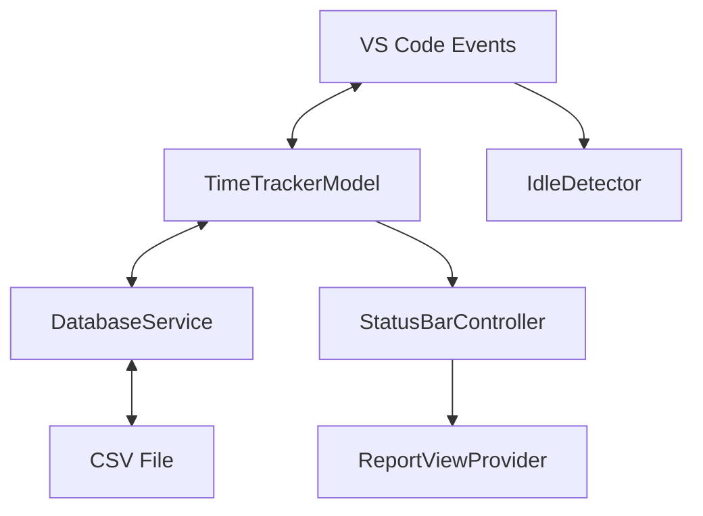

# VS Code Time Tracking Extension: Internal Architecture

This document explains the internal architecture and logic of the VS Code Time Tracking extension. It's intended for developers who want to understand, modify, or extend the extension's functionality.

## Core Components Overview

The extension is built with a modular architecture consisting of several key components:

1. **TimeTrackerModel**: Core data model for tracking sessions
2. **DatabaseService**: Service for CSV file operations
3. **StatusBarController**: UI controller for the status bar display
4. **ReportViewProvider**: WebView provider for displaying time reports
5. **IdleDetector**: Utility for detecting user inactivity



### Activation Process

When the extension activates:

1. `TimeTrackerModel` is initialized and initializes the `DatabaseService`
2. `DatabaseService` reads the CSV file and loads any saved sessions
3. `StatusBarController` is created to display the current tracking status
4. `IdleDetector` is set up to monitor user activity
5. Commands like `startTracking`, `stopTracking`, etc. are registered
6. The `ReportViewProvider` is registered to show time tracking reports

## Core Components in Detail

### TimeTrackerModel

**File:** `src/models/timeTracker.ts`

The `TimeTrackerModel` is the central data model handling all time tracking logic:

- **Session Management**: Maintains a list of completed sessions and the current active session
- **Data Structure**: Each session contains:
  ```typescript
  interface TimeSession {
    id: string;
    fileName: string;
    filePath: string;
    project: string;
    startTime: Date;
    endTime?: Date;
    duration: number; // in milliseconds
    category?: string;
    notes?: string;
  }
  ```
- **Time Calculation**: Uses a timer (`setInterval`) to update the duration of the current session
- **Storage**: Saves completed sessions to the extension's global state

**Key Methods:**
- `startTracking()`: Creates a new session for the current file
- `stopTracking()`: Ends the current session and saves it
- `handleEditorChange()`: Switches tracking to a new file when the active editor changes
- `getCurrentSession()`: Gets the active tracking session
- `getSessions()`: Returns all completed sessions
- `saveSessions()`: Persists sessions to VS Code storage
- `loadSessions()`: Loads sessions from storage

### Idle Detection Logic

**File:** `src/utils/idleDetection.ts`

The `IdleDetector` monitors user activity to ensure accurate time tracking:

1. **Activity Monitoring**: Listens to VS Code events (cursor movement, typing, etc.)
2. **Idle Detection**: Checks if the user has been inactive for longer than the threshold
3. **Configuration**: Uses the `timeTracking.idleThreshold` setting (in seconds)

When idle is detected, the extension prompts the user to either continue tracking or stop.

**Implementation Details:**
- Registers event listeners for user activity like:
  - Editor selection changes
  - Document changes
  - Terminal activity
  - Window state changes
- Uses a timer to check idle status every minute
- Records timestamps of the last detected activity

### Status Bar Integration

**File:** `src/ui/statusBarController.ts`

The `StatusBarController` manages the status bar display:

- Shows current tracking status (active/inactive)
- Displays tracked time for the current session
- Provides clickable commands to start/stop tracking
- Updates the display every second when tracking is active

### Report Generation

**File:** `src/ui/reportView.ts`

The `ReportViewProvider` generates visual reports of tracked time:

- **Data Organization**:
  - Groups sessions by project (`groupSessionsByProject`)
  - Groups sessions by day (`groupSessionsByDay`)
- **Visualizations**:
  - Summary statistics (total time, project count, session count)
  - Time spent per project
  - Recently tracked activity by day

### Time Utilities

**File:** `src/utils/timeUtils.ts`

Helper functions for time-related operations:

- `formatDuration()`: Formats milliseconds as "HH:MM:SS"
- `formatDurationShort()`: Formats as "Xh Ym"
- `formatDate()`: Converts dates to "YYYY-MM-DD" format
- `groupSessionsByDay()`: Groups sessions by their start date
- `groupSessionsByProject()`: Groups sessions by project name

## Extension Configuration

The extension supports these configuration settings:

- `timeTracking.autoTrack`: Whether to start tracking automatically when a file is opened
- `timeTracking.idleThreshold`: Time in seconds before considering the user idle
- `timeTracking.csvFilePath`: Path to the CSV file (default: `~/time-tracking.csv`)

## Storage Strategy

The extension uses CSV files for data persistence:

- Time tracking sessions are stored in a CSV file
- The default file location is `~/time-tracking.csv`
- The file path is configurable via the `timeTracking.csvFilePath` setting
- Sessions are automatically saved to the file when they end
- Each session is saved as a row in the CSV file

### CSV File Structure

The CSV file has the following header structure:

```
id,fileName,filePath,project,startTime,endTime,duration,category,notes
```

- Special characters in text fields are properly escaped following CSV standards
- Date fields are stored in ISO format for easy parsing
- Duration is stored in milliseconds as a number

### DatabaseService

**File:** `src/services/databaseService.ts`

The `DatabaseService` handles all CSV file operations:

- **File Management**: Creates the CSV file with headers if it doesn't exist
- **Data Serialization**: Converts TimeSession objects to CSV format and vice versa
- **CRUD Operations**: Provides methods to save and load time tracking data
- **Search & Analysis**: Offers specialized functions for statistics and reporting
- **Path Resolution**: Handles path expansion for the `~` home directory symbol

**Key Methods:**
- `saveSession()`: Saves a time tracking session to the CSV file
- `loadSessions()`: Loads all sessions from the CSV file
- `getCategoryStats()`: Calculates statistics about time spent per category
- `getProjectTotalTime()`: Calculates total time spent on a specific project
- `escapeCSV()`: Handles proper escaping of special characters in CSV fields
- `parseCSVLine()`: Parses CSV lines accounting for quoted fields and escaped quotes

## Command Registration

The extension registers the following commands:

- `time-tracking.startTracking`: Starts a new tracking session
- `time-tracking.stopTracking`: Stops the current session
- `time-tracking.toggleTracking`: Toggles tracking on/off
- `time-tracking.addCategory`: Adds a category to the current session
- `time-tracking.addNotes`: Adds notes to the current session

## Event Flow Example

**Starting a new tracking session:**

1. User executes the "Start Time Tracking" command or clicks the status bar item
2. `startTracking()` command handler is triggered
3. `TimeTrackerModel.startTracking()` creates a new session for the current file
4. A timer is started to update the session duration
5. `StatusBarController.startTimer()` is called to update the UI
6. `IdleDetector.startMonitoring()` begins watching for user inactivity
7. VS Code context is updated (`timeTracking.isTracking` = true)

**When user changes files:**

1. `onDidChangeActiveTextEditor` event is triggered
2. `TimeTrackerModel.handleEditorChange()` is called
3. Current session is ended and a new one is started for the new file

**When user is idle:**

1. `IdleDetector` detects no activity within the threshold period
2. User is prompted to continue or stop tracking
3. If "Stop Tracking" is chosen, tracking is ended and saved

## Advanced Features

### Multiple Project Support

The extension automatically categorizes sessions by project using VS Code's workspace concept. Each file is associated with its workspace folder, which is used as the project name.

### Session Categorization

Users can add categories to their tracking sessions to better organize their time. Categories are selected from a predefined list including "Coding", "Debugging", "Documentation", etc.

### Session Notes

Notes can be added to any active session to provide context about the work being done. These notes are stored with the session data and displayed in reports.

## CI/CD Pipeline

The extension uses GitHub Actions to automate the testing and publishing process:

### GitHub Actions Workflows

**File:** `.github/workflows/publish.yml`

The CI/CD pipeline consists of two main jobs:

1. **Build Job**
   - Triggered on push of tags starting with 'v' (e.g., v1.0.0) or manual triggering
   - Sets up Node.js and PNPM
   - Installs dependencies
   - Runs type checking, linting, and tests
   - Packages the extension into a VSIX file
   - Uploads the VSIX file as an artifact

2. **Publish Job**
   - Runs only after successful completion of the build job
   - Only runs when triggered by a version tag (e.g., v1.0.0)
   - Downloads the VSIX artifact from the build job
   - Publishes the extension to the VS Code Marketplace using the VSCODE_MARKETPLACE_TOKEN
   - Creates a GitHub Release with the VSIX attached

### GitHub Secrets

The workflow requires the following secret to be configured in the repository:

- `VSCODE_MARKETPLACE_TOKEN`: A Personal Access Token (PAT) from Azure DevOps with publishing rights

### Publishing Process

1. The version in `package.json` is updated
2. A new tag is created that matches the version (e.g., v1.0.0)
3. The tag is pushed to GitHub
4. The GitHub Actions workflow automatically:
   - Builds and tests the extension
   - Packages it into a VSIX file
   - Publishes it to the VS Code Marketplace
   - Creates a GitHub Release with the VSIX file attached

### Manual Override

The workflow can also be manually triggered from the GitHub Actions tab for testing or in case the automatic process fails.

## Performance Considerations

- Time calculations use millisecond precision for accuracy
- Idle detection checks run at a lower frequency (every minute) to minimize performance impact
- Status bar updates occur every second to provide real-time feedback without excessive updates
- Using CSV for storage provides simple, human-readable data format that can be easily viewed and edited
- File operations are properly error-handled to ensure data integrity
- In-memory caching of sessions improves performance for frequently accessed data

## Extension Points for Future Enhancement

1. **Data Export**: Add functionality to export time tracking data to other formats like JSON
2. **Visualization Improvements**: Enhanced charts and graphs for time analysis
3. **Team Integration**: Share time tracking data across a team
4. **Task Integration**: Link tracking sessions with tasks from issue trackers
5. **Automatic Categorization**: Use AI to suggest categories based on file content
6. **Data Backup**: Add functionality to backup and restore the CSV data